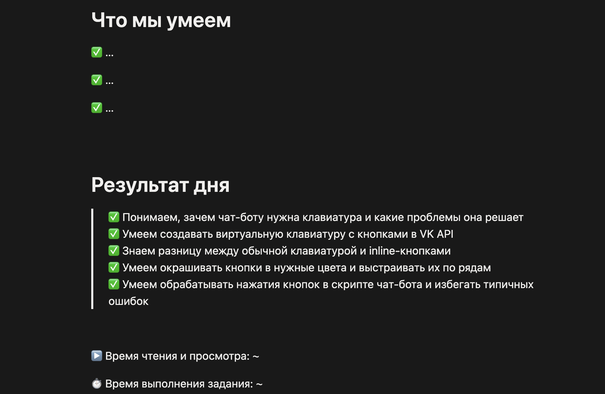
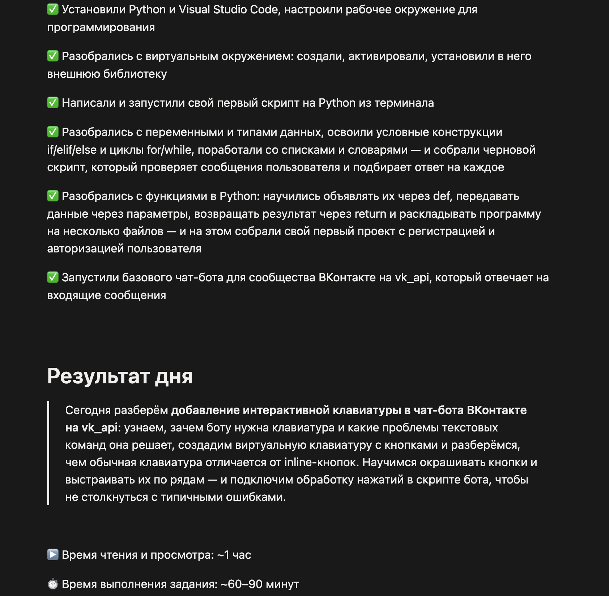

# Notion Lesson Assembler

Claude Code skill для автосборки урока онлайн-курса в Notion: сравнивает черновик урока (после транскрибации) с уроком-образцом, вносит формализуемые правки автоматически, а содержательные — только после подтверждения текста человеком, и записывает всё напрямую в Notion через Notion MCP.

Пилотный проект выполнен на модуле курса по Python в рамках производственного цикла онлайн-школы — методист вручную готовит только черновик урока (после транскрибации) и ссылки на исходники, остальную сборку берёт на себя агент.

## Проблема

После того как видео урока смонтированы и транскрибированы, методист вручную:
- сравнивает черновик с уроком-образцом, чтобы структура не разъехалась;
- формулирует и переносит в Notion блоки «Что мы умеем», тайминг, «На следующем занятии»;
- сокращает рыхлый текст после автотранскрибации;
- проверяет теорию на логичность и соответствие теме;
- пишет и оформляет домашнее задание;
- построчно вставляет всё это в Notion.

Это рутинная, но требующая внимательности работа, которая повторяется на каждом уроке курса.

## Как работает пайплайн

Skill получает на вход четыре ссылки на страницы Notion и тайминг видео, дальше работает в несколько шагов:

1. **Обязательная проверка перед стартом.** Прежде чем прочитать или тронуть черновик, skill спрашивает, сделана ли резервная копия урока в личном Notion автора. Без подтверждения — ни чтения, ни правок.
2. **Чтение и сопоставление.** Через Notion MCP агент получает markdown чернового урока, урока-образца и сценариев текущего/следующего урока, сопоставляет структуру разделов и стиль оформления (например, где текст под видео должен быть toggle-блоком, а где — обычным абзацем).
3. **Формализуемые правки — вносятся сразу, без подтверждения:**
   - блок «Что мы умеем» — по программе курса, что пройдено к этому уроку;
   - блок «На следующем занятии» — по сценарию следующего урока;
   - названия разделов — сверяются с содержимым и образцом, при расхождении исправляются;
   - тайминг — считается по формуле (сумма длительностей видео + 10–15 минут на чтение/просмотр, экспертная оценка времени на ДЗ).
4. **Содержательные правки — только после подтверждения текста методистом:**
   - «Результат дня» — сокращение/объединение пунктов после автотранскрибации по стилю образца;
   - домашнее задание — практикоориентированное, на основе программы курса, практики модуля и сценария урока;
   - проверка текста теории на логичность и соответствие теме;
   - проверка и дополнение раздела «Дополнительные материалы».

   Для этих пунктов агент показывает черновик правки текстом в диалоге и ждёт подтверждения, прежде чем записывать в Notion.
5. **Запись в Notion** — точечная, через обновление конкретных блоков markdown-страницы, а не перезапись всей страницы целиком (чтобы не потерять форматирование, вложенные toggle-блоки и вложения).
6. **Отчёт** — по итогам прогона агент собирает список внесённых правок текстом для быстрой сверки методистом.

### Auto vs подтверждение — почему так

Разделение основано на том, требует ли правка содержательного, субъективного решения:

| Категория | Примеры | Режим |
|---|---|---|
| Формализуемое | тайминг, «Что мы умеем», «На следующем занятии», названия разделов | вносится сразу |
| Содержательное | ДЗ, теория, «Результат дня», доп. материалы | текст показывается на подтверждение |

Плюс — постоянное structural-safety правило: обнаружив в черновике структурную аномалию (например, задвоенный раздел или блок не на своём месте), агент не переставляет и не удаляет блоки молча, а описывает находку и предлагает решение методисту.

## Вход и выход

**На входе** (передаётся в диалоге при вызове skill):
- ссылка на черновой урок в Notion (после автоматической транскрибации);
- ссылка на урок-образец (предыдущий урок модуля, эталон структуры);
- ссылка на сценарий текущего урока;
- ссылка на сценарий следующего урока;
- тайминг видео урока;
- локальные файлы контекста курса (учебная программа, практика модуля, формула расчёта тайминга — методист готовит их один раз и обновляет вручную при изменении программы).

**На выходе:**
- собранная страница урока в Notion, готовая к финальной проверке методистом (а не к сборке с нуля);
- текстовый список внесённых правок.

## Пилотный запуск

Skill опробован на реальном уроке пилотного модуля курса. По итогам одного прогона агент: сопоставил структуру с образцом и нашёл несоответствие уровней вложенности toggle-блоков; собрал блок «Что мы умеем» из результата предыдущего урока; переписал «Результат дня» из списка в связный абзац по стилю образца; проверил и дополнил домашнее задание на основе программы и практики модуля; посчитал тайминг по формуле; нашёл и предложил решение структурной аномалии (задвоенный раздел «Домашнее задание»). Содержательные правки — «Результат дня», ДЗ, оформление — заняли несколько раундов подтверждения текстом в диалоге, формализуемые внеслись без лишних вопросов.

Подробности этого прогона — во внутреннем отчёте `reports/`, который не публикуется в этом репозитории (см. «Что не публикуется» ниже).

## Скриншоты

**До:** незаполненные разделы: "Что мы умеем", "Результат дня", "Время".



**После:** агент, опираясь на структуру урока и учебную программу курса, предложил варианты заполнения данных разделов.



## Технологии

- [Claude Code](https://claude.com/claude-code) — как среда выполнения skill;
- [Notion MCP](https://developers.notion.com/) — чтение и точечная запись страниц урока;
- Skill описан в `.claude/skills/assemble-lesson/SKILL.md` — весь пайплайн задан как markdown-инструкция, без отдельного кода.

## Как запустить

1. Подключить Notion MCP в Claude Code (см. [документацию Claude Code по MCP](https://docs.claude.com/en/docs/claude-code/mcp)).
2. Положить в `context/` (создаётся локально, не публикуется — см. ниже) собственные файлы курса:
   - `course-program.md` — учебная программа;
   - `m7-practice.md` — практика модуля;
   - `methodist-bible-timing.md` — формула расчёта тайминга.
3. В диалоге с Claude Code вызвать skill `assemble-lesson` и передать: ссылку на черновой урок, ссылку на урок-образец, ссылку на сценарий текущего урока, ссылку на сценарий следующего урока, тайминг видео.
4. Подтвердить резервную копию урока, когда спросит агент.
5. Проверить и подтвердить содержательные правки, когда агент их покажет.

## Структура репозитория

```
.
├── .claude/skills/assemble-lesson/SKILL.md   — логика пайплайна
├── PROJECT.md                                — описание проекта и MVP
├── README.md
└── context/, reports/                        — локальные, в .gitignore (см. ниже)
```

## Что не публикуется

`context/` и `reports/` добавлены в `.gitignore`. Это внутренние материалы конкретной онлайн-школы: учебная программа, практика модуля, реальные отчёты по урокам со ссылками на корпоративный Notion. Проект создан для внутреннего производственного процесса компании, поэтому эти данные остаются только в локальной копии репозитория.
